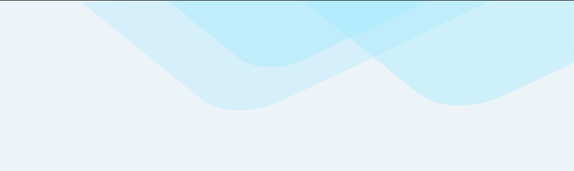

# Recreating a Landing Page

To practice CSS I decided to recreate a website.

Recently the site has been updated but here is a screenshot of the old one: 


It is a rather simple page but it is also elegant and responsive in a way that I would like to practice
and study on a deeper level.

My result, a simplified and responsive version can be found here: [Codepen: Recreating a Landing Page](https://codepen.io/marcusgsta/pen/bGNWGLJ)

I divided my work into smaller parts. Here are some main points and lessons learned:

+ [Semantic HTML](#semantic-html)
+ [ColorZilla](#colorzilla)
+ [CSS Custom Properties](#css-custom-properties)
+ [CSS or SVG?](#css-or-svg)
+ [SASS Mixins to not repeat code](#sass-mixins-to-not-repeat-code)
+ [SVG](#svg)
+ [Responsive Menu](#responsive-menu)
+ [Box Shadow for :focus](#box-shadow-for-focus)
+ [The React Training Logo in CSS](#the-react-training-logo-in-css)
+ [Consistent spacing with ems and rems](#consistent-spacing-with-ems-and-rems)
+ [CSS Card](#css-card)
+ [Layout and centering with Flexbox and CSS Grid](#layout-and-centering-with-flexbox-and-css-grid)
+ [Conclusion](#conclusion)

The webpage is organized in blocks or cards which is good for responsiveness, since they can be moved around
without messing up the page.

It also uses some subtle background forms for decoration.

So, let's get started. Mobile first, so I shrink it in a separate window of Chrome. I will first create the page without looking at the source code, since I am doing this to learn and to figure out solutions for myself.

I use SASS but I would like to try out using native CSS custom properties.

- - -

## Semantic HTML

After marking up everything in semantic HTML ( nav, header, footer, main, some sections and articles, I am ready to start.
First thing that would be nice is some color. The background is also logical to start with, since I am thinking in terms of layers, and this is the layer that is at the back of everything.

## Colorzilla

Using a chrome extension, [ColorZilla](https://www.colorzilla.com/), which is a color picker and eye dropper tool, I can get the color code for the background.


## CSS Custom Properties

Since CSS Custom Properties (variables) inherit the value from its parent, I set my background-color to the :root pseudo class. This class is identical to the html element but its specificity is higher and therefore good for when setting CSS variables.

```css
:root {
  --background: #EDF4F7;
}

body {
  background-color: var(--background);  
}
```
This way I can use the variables in any (child) element in the document.

## CSS or SVG?

The background decorations, a couple of simple forms, can be made in a illustrator program as a PNG or SVG. Looking at the shapes, they are very simple, and could also be made with the help of some CSS. It's time to put my CSS knowledge to use.

There are three rectangles with rounded edges, or perhaps triangles are a better fit, since the sides are not 90 degrees but larger. This is what it looks like:


I create a new div with the class of 'shapes'. Since each div can have two extra div:s in the form of the pseudo-elements :before and :after, this is all that is needed for the HTML.

The CSS triangle which uses borders and zero width and height creates a right-angled triangle, but I need a wider angle. I also try using clip-path but this doesn't seem to let me do rounded angles.


## SASS Mixins to not repeat code

Since I will be repeating the same shape three times, I could also make use of a SASS mixin, to reduce repeating lines of code. However, this seems not to be available using CSS only. Since I'd like to delve into writing functions I change my mind from previously and add SCSS preprocessor to my Codepen.

## SVG

The shapes are overlapping and using opacity, which makes it even more tricky using only CSS. Finally I go for SVG, using an [editor](https://svg-edit.github.io/svgedit/releases/svg-edit-2.8.1/svg-editor.html) to draw it and then copy the SVG code.

It took some time adjusting the SVG shapes with CSS, this is what I got:



SVG is actually excellent since it is possible to change and tweak the color and size of them with CSS. I used hsla-color, so that I could easily adjust the intensity, lightness and opacity.

The HTML:

```html
<svg viewbox="-100 0 500 600" id="shapes" xmlns="http://www.w3.org/2000/svg">
 <g>
  <path id="shape-one" d="m0.565004,-0.718787l85.767768,69.509633c0,0 20.584272,20.138305 61.752803,1.299244c41.16853,-18.839061 165.531798,-79.253964 165.531784,-79.253975" stroke-width="0"/>
   <path id="shape-two" d="m0.565004,-0.718787l85.767768,69.509633c0,0 20.584272,20.138305 61.752803,1.299244c41.16853,-18.839061 165.531798,-79.253964 165.531784,-79.253975" stroke-width="0"/>
   <path id="shape-three" d="m0.565004,-0.718787l85.767768,69.509633c0,0 20.584272,20.138305 61.752803,1.299244c41.16853,-18.839061 165.531798,-79.253964 165.531784,-79.253975" stroke-width="0"/>
 </g>
</svg>
```
The CSS, using SCSS @mixin and @include to reduce amount of code.:

```css
:root {
  --background: #EDF4F7;
  --bg-shape1: hsla(196, 85%, 86%, 0.4);
  --bg-shape2: hsla(196, 95%, 84%, 0.4);
  --bg-shape3: hsla(196, 95%, 84%, 0.4);
}
* {
  padding: 0;
  margin: 0;
}
body {
  background-color: var(--background);
  z-index:-10;
}

@mixin style-shape($top, $left, $color, $width,$height) {
  position: absolute;
  top: $top;
  left:$left;
  width:$width;
  height:$height;
  fill:$color;
  z-index:-5;
}

#shapes {
  width:100%;
  height:100%;
}
#shape-one {
  @include style-shape(30px, 0, var(--bg-shape1), 100%, 100%);
  transform:translateY(2px) translateX(-30px) scale(1.2);
}
#shape-two {
   @include style-shape(-50px, 0, var(--bg-shape2), 100%, 100%);
  transform:translateY(-20px)
            translateX(20px);
}
#shape-three {
   @include style-shape(-50px, 0, var(--bg-shape3), 100%, 100%);
  transform:translateY(-10px)
            translateX(150px)
            scale(1.3);
}
```
I also made it reponsive, setting the sizes to percentages.

## Responsive Menu
Starting with the menu button for a mobile sized screen, I put some color, border-radius and a little triangle icon that was part of the font. It also needed some JavaScript. The tricky part was to hide the menu when clicking outside of the menu.

```javascript
let menuBtn = document.querySelector('#menu-btn');
let menuOptions = document.querySelector('#menu-options');
let workShopLink = document.getElementById('workshop');


function closeMenu(e) {    
 if (e.target != menuBtn && menuOptions.style.display === "block") {
  menuOptions.style.display = "none";   
 }
 document.body.removeEventListener("click", closeMenu);
}

function showHideMenu(e) {
    console.log(menuOptions.style.display)
    if ( menuOptions.style.display === "none" || menuOptions.style.display === "") {
        menuOptions.style.display = "block";
        menuOptions.style.outline = "none";
        workShopLink.focus();
        // add click event for body
        document.body.addEventListener("click", closeMenu, true);
    } else {
        menuOptions.style.display = "none";
    }
}

menuBtn.addEventListener("click", showHideMenu);


workShopLink.addEventListener("mouseover", function() {
  workShopLink.blur();
});

function focusMenu() {
    menuOptions.classList.add("focused");
}
function blurMenu() {
    menuOptions.classList.remove("focused");
}

menuOptions.addEventListener("mouseover", blurMenu);
menuOptions.addEventListener("mouseout", focusMenu);

```
I also added some extra functionality: an outline on the menu items when the mouse leaves them. This was fixed with the events mouseover and mouseout. Finally I got a menu that could be shown and hidden on mouseclick.

## Box Shadow for focus

This handy trick I got from Kevin Powell [Box Shadow for :focus](https://youtu.be/Mvu5OMGcdVA), that made it possible to get rounded edges, something that is not possible with the outline property.
```css
  .focused {
      box-shadow:0 0 0 2px var(--background),
                 0 0 0 5px dodgerblue;
  }
```
The .focused class is added on the mouseout event. It utilizes 2 box shadows on top of each other to get a nice rounded frame.

## The React Training Logo in CSS

For some CSS fun I recreated this logo with pure CSS. It is not identical, but looks pretty good I think.

```css
    // DRAWING REACT TRAINING LOGO WITH CSS
    #logo {
        position:relative;
        display:inline-block;
        top:0;
        left:0;
        margin-right:1.5em;
        width:100px;
        height:100px;
        background-color:var(--black);
        border-radius:50%;
        background:radial-gradient(circle at center, #fff 0, #fff 12%, var(--black) 13%);
        z-index:100;
        #inner-ellipse-one {
            // oval
            z-index:-10;
            position:absolute;
            top:32px;
            left:5px;
            width:80px;
            height:30px;
            border:4px solid var(--red);
            border-radius:50%;
            transform:rotate(120deg);
        }
        &:before {
            // oval
            content:"";
            position:absolute;
            top:31px;
            left:6px;
            width:80px;
            height:30px;
            background-color:transparent;
            border:4px solid #fff;
            border-radius:50%;
        }
        &:after {
            // oval
            content:"";
            position:absolute;
            top:31px;
            left:6px;
            width:80px;
            height:30px;
            background-color:transparent;
            border:4px solid var(--grey);
            border-radius:50%;
            transform:rotate(60deg);
        }
    }
```
The result:


To make a more exact copy, I would use an SVG-editor.


## Consistent spacing with ems and rems 

I wanted to get consistent spacing throughout the page, and I felt I needed a better understanding of ems and rems. Again a video by [Kevin](https://www.youtube.com/watch?v=_-aDOAMmDHI) came to the rescue.

So, the background is that *em* is a unit of measurement in typography and traditionally defined as the width of the uppercase M in the current face and point size. In CSS *em* is relative to the font-size of its direct or nearest parent, while *rem*, or root em, relates to the font-size of the html(root) font-size in the document.

We can use this to style margins and paddings. I first set the base font-size to 16 pixels in the HTML element. Then I let all margins and padding be either 1, 1.5, 2, or a different number of ems. It turned out to be way easier to control the spacing this way, than using pixels.

The good thing about it is that if I change the base font-size, all the spacing will change too, in a consistent way.

The spacing in ems follows its parent's font-size, and ofcourse one needs to be careful and not nest font-sizes, because they will compound. In cases where I had a special element, like a button, I chose to use rem instead, to avoid this problem. The font-sizes in rem relates directly to the html font-size.

I think the page looks so much better with consistent spacing.

## CSS Card

I experimented with box shadow for the card, and got it allright, but finally I had a look at the original one. This one gives a subtle shadow:

```css
box-shadow: 0px 2px 10px hsla(0,0%,0%,0.15);
```
Horisontal offset of 0, a very subtle vertical offset of 2px, and a blur of 10px. Color is black with 0.15 opacity.


## Layout and centering with Flexbox and CSS Grid

Flexbox was invaluable for the layout design. With `display:flex` I could for example change the order of the sections on large screens:

```css
@media (min-width: 790px) {
    #flash {
      display:flex;
      flex-flow: row wrap;
      justify-content: center;
    }
    #call-to-action {
      flex-basis:380px;
      order:2;
    }
    #subscription {
      flex-basis:380px;
      order:1;
    }
}
```css
`justify-content: center` centers items vertically.


It also turned out to be a challenge centering an unordered list. Finally flexbox made it super simple. It seems to be the goto solution nowadays.

For the footer I used CSS grid, because I wanted the social media icons to be at the left side, and the mail address link to be in the middle. This was solved by a three column layout, where the middle columns set to `auto`:

```css
#extra-footer {
    padding:1em;
    background: #333333;
    // position of logos and mail-link
    display:grid;
    grid-template-columns: 8em auto 8em;
    a {
        color: var(--lightgrey);
    }
    // social media logos
    i.fab {
        font-size:1.5em;
        &:nth-child(1) {
            margin-right:0.2em;            
        }
        &:hover {
            color:#fff;
        }
    }
    a.mail-link {
        text-align:center;
        // vertically center with css grid:
        align-self:center;
        &:hover {
            text-decoration: underline;
        }
    }
}
```


To vertically center the mail address, using CSS Grid, I needed `align-self: center`. 

## Conclusion

Some things I have learned from remaking a website.

### CSS vs SCSS variables

I like that I can use CSS custom properties and exclude the need for a CSS preprocessor like SASS. The thing I miss with SASS variables is the functions I can use with them, like lighten(), darken() which can be really handy for tweaking color schemes right in the editor. The thing is that even if I have SASS installed, I can't tweak the CSS custom properties. If I want that functionality I need to write SASS variables ($red).

### Consistent spacing

This was a very valuable lesson, which I will use again. A base font-size, and ems for margins and padding, makes the page look much better and balanced in all of its spacing.

### Menu 

It was fun to make a responsive menu from scratch, using some JavaScript. However, recently I came across the [radio-button hack](https://www.youtube.com/watch?v=8QKOaTYvYUA), which I now prefer for its simplicity.

### Other lessons learned

I recommend remaking websites after your own head, it is a great way to learn. It's fun to make a whole page and get a better sense of how all the different parts can be put together. I feel more confident now in how to put up a professional looking website without the use of frameworks. It definitely sharpened my CSS skills.

Another point I would like to make is that CSS illustration have taught me a great deal, but it is not the same as making websites. In CSS illustration one mostly uses absolute positioning and set pixel sizes for convenience. Making a website responsive is something else and needs special knowledge, such as consistent spacing by knowing how to use ems and rems, media queries for different screen sizes and proper use of CSS Grid and flexbox. 

Hope my work was valuable to you in some way. Please leave a like if it did, or make a comment below on how one could improve the design. Til next time, happy coding :) 


